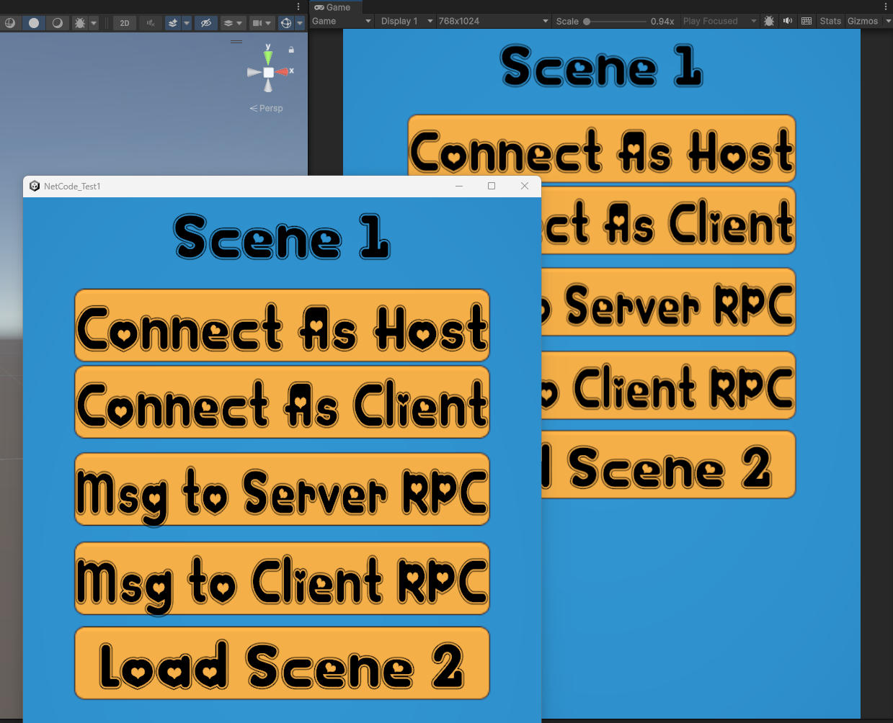

# StayOnTopWindowsUnity3d
Useful for Multiplayer game development in unity3d.
Only for Windows Operating Sytems.
The `StayOnTop` Unity component ensures that your Unity game window remains on top of other windows like Unity Editor during runtime. This component is especially useful for applications where you need to maintain focus on the game window.

